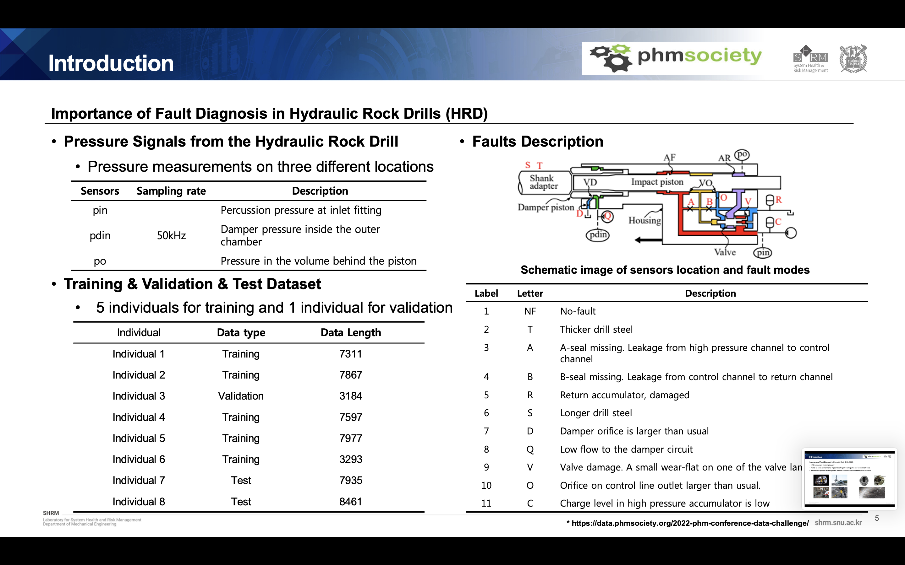
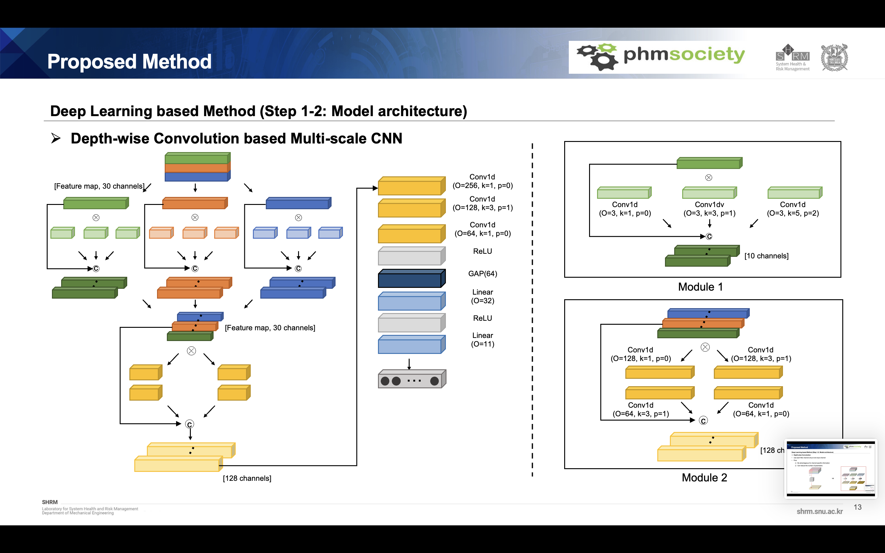
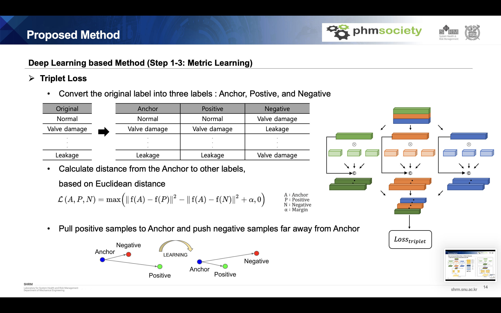
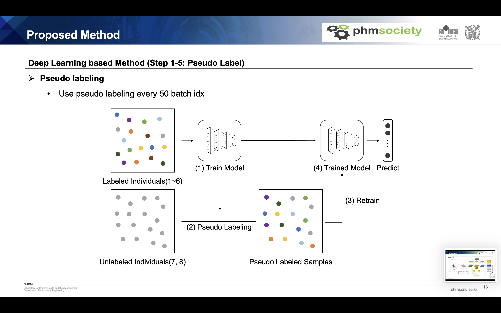
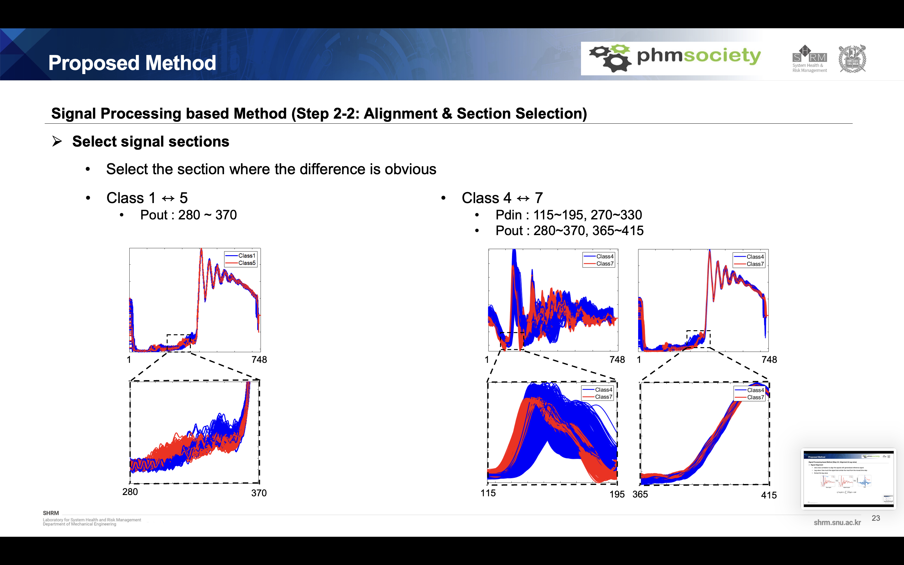
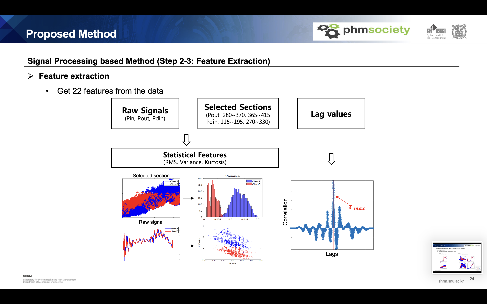
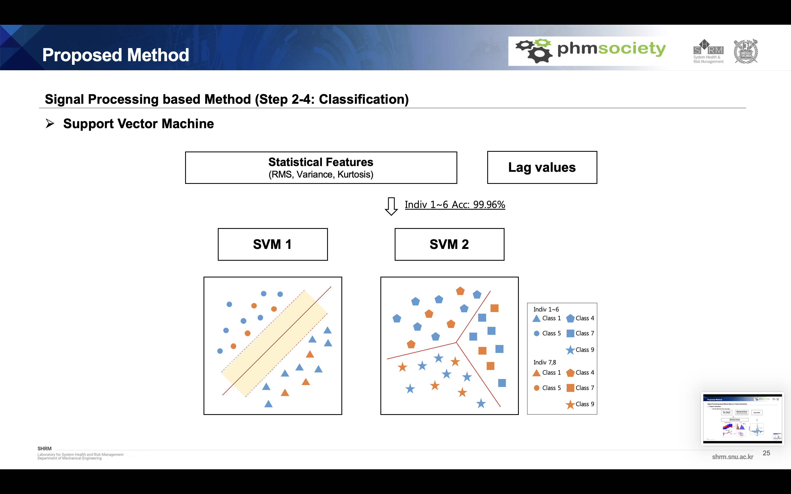
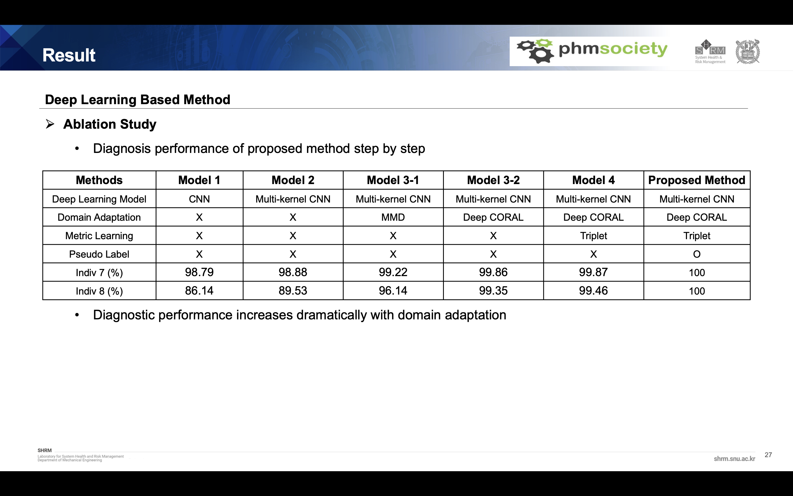

# HRD Fault diagnosis using hybrid method of deep learning and signal processing


## Background of research
HRD is used in many drilling operations like excavation and it is important in mining industry. As HRD frequently operates under harsh conditions, diverse failures modes occur and these makes potentials for personal injuries and economic losses. So, Reliable and prompt fault diagnosis method is needed to ensure safety from accidents

 

 ## Data description
 - 8 different working conditions
 - 11 health conditions (fault type) information
 - 3 sensors information
The data set is from 2022 PHM Society Data Challenge. We can use three types of pressure signal of HRD, Percussion pressure at inlet fitting, Damper pressure inside the outer chamber, Pressure in the volume behind the piston. there are many individuals from 1 to 8 where the data distributions are different to each other. And finally, there are 10 types of fault modes in HRD as you can see in the right table. There are some fault pairs that are really difficult to classify and it is also challenging. 
 

## Flow chart of proposed method
 


 
 ```
 class customdataset(Dataset):
    def __init__(self, data, label): 
        super().__init__()
        self.pin_data=data[:,0,:].unsqueeze(1)   
        self.po_data=data[:,1,:].unsqueeze(1)
        self.pdin_data=data[:,2,:].unsqueeze(1)
        self.label=label
        
    def __len__(self):
        return len(self.label)
  
    def __getitem__(self, idx):
        pin_data = self.pin_data[idx]
        po_data = self.po_data[idx]
        pdin_data = self.pdin_data[idx]
        label = self.label[idx] 
                
        return  pin_data.to(device).float(),po_data.to(device).float(),pdin_data.to(device).float(), label.to(device)
class customdataset_ts(Dataset):
    def __init__(self, data): 
        super().__init__()
        self.pin_data=data[:,0,:].unsqueeze(1)   
        self.po_data=data[:,1,:].unsqueeze(1)
        self.pdin_data=data[:,2,:].unsqueeze(1)
        
    def __len__(self):
        return len(self.pin_data)
  
    def __getitem__(self, idx):
        pin_data = self.pin_data[idx]
        po_data = self.po_data[idx]
        pdin_data = self.pdin_data[idx]
                
        return  pin_data.to(device).float(),po_data.to(device).float(),pdin_data.to(device).float()
def loaders(data,label, data2,label2):
    train_set, valid_set, train_label, valid_label = train_test_split(data, label, train_size=0.9, random_state=1)
    traindataset = customdataset(train_set, train_label)
    validdataset = customdataset(valid_set, valid_label)
    traindataloader1 = DataLoader(traindataset, batch_size=32, shuffle=True, drop_last=True )
    validdataloader1 = DataLoader(validdataset, batch_size=32, shuffle=True, drop_last=True )
    testdataset = customdataset(data2, label2)
    testloader = DataLoader(testdataset, batch_size=1, shuffle=False, drop_last=False )
    return traindataloader1,validdataloader1,testloader
 ```

 

 '''
 class GlobalAvgPool(nn.Module):
    def __init__(self):
        super(GlobalAvgPool,self).__init__()
    def forward(self,x):
        return x.mean(axis=-1) 
    
class Feature_extractor1(nn.Module):

    def __init__(self):
        super(Feature_extractor1, self).__init__()
        self.bn = nn.BatchNorm1d(1)
        self.conv1 = nn.Sequential(nn.Conv1d(1, 3, kernel_size=1, stride = 1, padding=0),
                                 nn.ReLU())
        self.conv2 = nn.Sequential(nn.Conv1d(1, 3, kernel_size=3, stride = 1, padding=1),
                                 nn.ReLU())
        self.conv3 = nn.Sequential(nn.Conv1d(1, 3, kernel_size=5, stride = 1, padding=2),
                                 nn.ReLU())

        
        
    def forward(self, x):
        x = self.bn(x)
        x1 = self.conv1(x)
        x2 = self.conv2(x)
        x3 = self.conv3(x)
        
        return x1,x2,x3
class Feature_extractor2(nn.Module):

    def __init__(self):
        super(Feature_extractor2, self).__init__()
        self.bn = nn.BatchNorm1d(1)
        self.conv1 = nn.Sequential(nn.Conv1d(1, 3, kernel_size=1, stride = 1, padding=0),
                                 nn.ReLU())
        self.conv2 = nn.Sequential(nn.Conv1d(1, 3, kernel_size=3, stride = 1, padding=1),
                                 nn.ReLU())
        self.conv3 = nn.Sequential(nn.Conv1d(1, 3, kernel_size=5, stride = 1, padding=2),
                                 nn.ReLU())

        
        
    def forward(self, x):
        x = self.bn(x)
        x1 = self.conv1(x)
        x2 = self.conv2(x)
        x3 = self.conv3(x)
        
        return x1,x2,x3
class Feature_extractor3(nn.Module):

    def __init__(self):
        super(Feature_extractor3, self).__init__()
        self.bn = nn.BatchNorm1d(1)
        self.conv1 = nn.Sequential(nn.Conv1d(1, 3, kernel_size=1, stride = 1, padding=0),
                                 nn.ReLU())
        self.conv2 = nn.Sequential(nn.Conv1d(1, 3, kernel_size=3, stride = 1, padding=1),
                                 nn.ReLU())
        self.conv3 = nn.Sequential(nn.Conv1d(1, 3, kernel_size=5, stride = 1, padding=2),
                                 nn.ReLU())

        
        
    def forward(self, x):
        x = self.bn(x)
        x1 = self.conv1(x)
        x2 = self.conv2(x)
        x3 = self.conv3(x)
        
        return x1,x2,x3


class SimpleConv(nn.Module):
    def __init__(self):
        super(SimpleConv,self).__init__()
        self.bn_concat = nn.BatchNorm1d(30)

        self.bottle_1 = nn.Conv1d(30,128,kernel_size=1, stride=1, bias=False)
        self.bottle_2 = nn.Conv1d(128,64, kernel_size=3, stride=1, bias=False, padding=1)

        self.bottle_3 = nn.Conv1d(30,128,kernel_size=3, stride=1, bias=False, padding=1)
        self.bottle_4 = nn.Conv1d(128, 64, kernel_size=1, stride=1, bias=False)

        self.bn_bottleneck24 = nn.BatchNorm1d(30+64+64)

        self.bottle_5 = nn.Conv1d(30+64+64,256,kernel_size=1, stride=1, bias=False)
        self.bottle_6 = nn.Conv1d(256,128,kernel_size=3, stride=1, bias=False, padding=1)

        self.bn_output = nn.BatchNorm1d(128)
        self.conv_out = nn.Conv1d(128, 64, kernel_size=1, stride=1, bias=False)
        self.relu =  nn.ReLU()
        self.gap = GlobalAvgPool()
        

        self.fc1 = nn.Sequential(
            nn.Linear(64, 32),
            nn.BatchNorm1d(32),
            nn.ReLU())
        self.fc2 =nn.Linear(32, 11)

    def forward(self, inputs):
        concat = self.relu(inputs)
        bn_concat = self.bn_concat(concat)

        bottle_1 = self.bottle_1(bn_concat)
        bottle_1 = self.relu(bottle_1)
        bottle_2 = self.bottle_2(bottle_1)
        bottle_2 = self.relu(bottle_2)

        bottle_3 = self.bottle_3(bn_concat)
        bottle_3 = self.relu(bottle_3)
        bottle_4 = self.bottle_4(bottle_3)
        bottle_4 = self.relu(bottle_4)

        bottle24_concat = torch.cat([bn_concat, bottle_2, bottle_4],axis=1)
        bottle24_concat = self.bn_bottleneck24(bottle24_concat)

        bottle_5 = self.bottle_5(bottle24_concat)
        bottle_5 = self.relu(bottle_5)
        bottle_6 = self.bottle_6(bottle_5)
        bottle_6 = self.relu(bottle_6)

        conv_out = self.bn_output(bottle_6)
        out = self.conv_out(conv_out)
        out = self.relu(out)
        outview = self.gap(out)

        out = self.fc1(outview)
        out = self.fc2(out)

        return out,outview


feature_extractor1 = Feature_extractor1().to(device)
feature_extractor2 = Feature_extractor2().to(device)
feature_extractor3 = Feature_extractor3().to(device)
SimpleConvmodel = SimpleConv().to(device)

'''

 
 '''
 class TripletCustomdataset(Dataset):
    def __init__(self, data, label):
        # self.data=data   
        self.pin_data=data[:,0,:].unsqueeze(1)   
        self.po_data=data[:,1,:].unsqueeze(1)
        self.pdin_data=data[:,2,:].unsqueeze(1)
        
        self.label=label
        self.index = array(range(len(label)))
        
    def __len__(self):
        return len(self.label)
    
    def __getitem__(self, item):      
        
        anchor_pin_data = self.pin_data[item]
        anchor_po_data = self.po_data[item]
        anchor_pdin_data = self.pdin_data[item]
        
        anchor_label = self.label[item]

        positive_list = self.index[self.index!=item][self.label[self.index!=item]==anchor_label]

        positive_item = random.choice(positive_list)
        
        positive_pin_data = self.pin_data[positive_item]
        positive_po_data = self.po_data[positive_item]
        positive_pdin_data = self.pdin_data[positive_item]
        
        
        negative_list = self.index[self.index!=item][self.label[self.index!=item]!=anchor_label]
        negative_item = random.choice(negative_list)
        negative_pin_data = self.pin_data[negative_item]
        negative_po_data = self.po_data[negative_item]
        negative_pdin_data = self.pdin_data[negative_item]

        return anchor_pin_data.to(device).float(),anchor_po_data.to(device).float(),anchor_pdin_data.to(device).float(), positive_pin_data.to(device).float(),positive_po_data.to(device).float(),positive_pdin_data.to(device).float(), negative_pin_data.to(device).float(),negative_po_data.to(device).float(),negative_pdin_data.to(device).float(), anchor_label.to(device)
def tripletloader(data,label):
    tripletdataset=TripletCustomdataset(data,label)
    triplet__dataloader = DataLoader(tripletdataset, batch_size=32, shuffle=True, drop_last=True )
    return triplet__dataloader

class TripletLoss(nn.Module):
    def __init__(self, margin=1.0):
        super(TripletLoss, self).__init__()
        self.margin = margin
        
    def calc_euclidean(self, x1, x2):
        return (x1 - x2).pow(2).sum(1)
    
    def forward(self, anchor: torch.Tensor, positive: torch.Tensor, negative: torch.Tensor) -> torch.Tensor:
        
        distance_positive = self.calc_euclidean(anchor, positive)
        distance_negative = self.calc_euclidean(anchor, negative)
        losses = torch.relu(distance_positive - distance_negative + self.margin)
        
        return losses.mean()
    
tripletloss=TripletLoss()


 '''

 
 '''
 def CORAL(source, target):
    d = source.data.shape[1]

    # source covariance
    xm = torch.mean(source, 0, keepdim=True) - source
    xc = xm.t() @ xm # matmul

    # target covariance
    xmt = torch.mean(target, 0, keepdim=True) - target
    xct = xmt.t() @ xmt

    # frobenius norm between source and target
    loss = torch.mean(torch.mul((xc - xct), (xc - xct)))
    loss = loss/(4*d*d)

    return loss
T1 = 100
T2 = 700
af = 3

def alpha_weight(step):
    if step < T1:
        return 0.0
    elif step > T2:
        return af
    else:
         return ((step-T1) / (T2-T1))*af

 '''

 
 
 '''
 def train_target(extractor1,extractor2,extractor3,classifier, criterion, dataloader,tdataloader,triplet_loader, optimizer, epoch, step):
    
    # setup models
    extractor1.eval()
    extractor2.eval()
    extractor3.eval()
    classifier.eval()
    
    # steps
    start_steps = epoch * len(dataloader)
    total_steps = 10 * len(dataloader)
    
    for batch_idx, tdata in enumerate(tdataloader):        # prepare the data
        # signal1,signal2,signal3,label = data
        # signal1,signal2,signal3,label = Variable(signal1.cuda()), Variable(signal2.cuda()),Variable(signal3.cuda()),Variable(label.cuda().long())
        # tsignal1,tsignal2,tsignal3,tlabel = tdata
        tsignal1,tsignal2,tsignal3 = tdata
        # tsignal1,tsignal2,tsignal3,tlabel = Variable(tsignal1.cuda()), Variable(tsignal2.cuda()),Variable(tsignal3.cuda()),Variable(tlabel.cuda())
        tsignal1,tsignal2,tsignal3 = Variable(tsignal1.cuda()), Variable(tsignal2.cuda()),Variable(tsignal3.cuda())
        # anchor_pin_data, anchor_po_data, anchor_pdin_data, positive_pin_data, positive_po_data, positive_pdin_data, negative_pin_data, negative_po_data, negative_pdin_data,anchor_label=tripletdata
        # anchor_pin_data, anchor_po_data, anchor_pdin_data, positive_pin_data, positive_po_data, positive_pdin_data, negative_pin_data, negative_po_data, negative_pdin_data,anchor_label = Variable(anchor_pin_data.cuda()), Variable(anchor_po_data.cuda()),Variable(anchor_pdin_data.cuda()),Variable(positive_pin_data.cuda()), Variable(positive_po_data.cuda()),Variable(positive_pdin_data.cuda()),Variable(negative_pin_data.cuda()), Variable(negative_po_data.cuda()),Variable(negative_pdin_data.cuda()),Variable(anchor_label.cuda().long())
        
        
        optimizer.zero_grad()
        tfeature11,tfeature21,tfeature31 = extractor1(tsignal1)
        tfeature12,tfeature22,tfeature32 = extractor2(tsignal2)
        tfeature13,tfeature23,tfeature33 = extractor3(tsignal3)
        tfeature=torch.cat((tsignal1,tsignal2,tsignal3,tfeature11,tfeature21,tfeature31,tfeature12,tfeature22,tfeature32,tfeature13,tfeature23,tfeature33),dim=1)
        tout ,_= classifier(tfeature)   
        _, pseudo = torch.max(tout,1)
                
        
        extractor1.train()
        extractor2.train()
        extractor3.train()
        classifier.train()
        tfeature11,tfeature21,tfeature31 = extractor1(tsignal1)
        tfeature12,tfeature22,tfeature32 = extractor2(tsignal2)
        tfeature13,tfeature23,tfeature33 = extractor3(tsignal3)
        tfeature=torch.cat((tsignal1,tsignal2,tsignal3,tfeature11,tfeature21,tfeature31,tfeature12,tfeature22,tfeature32,tfeature13,tfeature23,tfeature33),dim=1)

        tout ,_= classifier(tfeature)      
        loss = alpha_weight(step)*criterion(tout, pseudo)
        
       
        loss.backward()
        optimizer.step()
        if batch_idx % 50 ==0:
            for batch_idx, (data,tdata, tripletdata) in enumerate(zip(dataloader,tdataloader, triplet_loader)):        # prepare the data
                signal1,signal2,signal3,label = data
                signal1,signal2,signal3,label = Variable(signal1.cuda()), Variable(signal2.cuda()),Variable(signal3.cuda()),Variable(label.cuda().long())
                # tsignal1,tsignal2,tsignal3,tlabel = tdata
                tsignal1,tsignal2,tsignal3 = tdata
                tsignal1,tsignal2,tsignal3 = Variable(tsignal1.cuda()), Variable(tsignal2.cuda()),Variable(tsignal3.cuda())
                # tsignal1,tsignal2,tsignal3,tlabel = Variable(tsignal1.cuda()), Variable(tsignal2.cuda()),Variable(tsignal3.cuda()),Variable(tlabel.cuda())
                anchor_pin_data, anchor_po_data, anchor_pdin_data, positive_pin_data, positive_po_data, positive_pdin_data, negative_pin_data, negative_po_data, negative_pdin_data,anchor_label=tripletdata
                anchor_pin_data, anchor_po_data, anchor_pdin_data, positive_pin_data, positive_po_data, positive_pdin_data, negative_pin_data, negative_po_data, negative_pdin_data,anchor_label = Variable(anchor_pin_data.cuda()), Variable(anchor_po_data.cuda()),Variable(anchor_pdin_data.cuda()),Variable(positive_pin_data.cuda()), Variable(positive_po_data.cuda()),Variable(positive_pdin_data.cuda()),Variable(negative_pin_data.cuda()), Variable(negative_po_data.cuda()),Variable(negative_pdin_data.cuda()),Variable(anchor_label.cuda().long())

                optimizer.zero_grad()
     
                
                feature11,feature21,feature31 = extractor1(signal1)
                feature12,feature22,feature32 = extractor2(signal2)
                feature13,feature23,feature33 = extractor3(signal3)
                feature=torch.cat((signal1,signal2,signal3,feature11,feature21,feature31,feature12,feature22,feature32,feature13,feature23,feature33),dim=1)
                # feature=torch.cat((feature1, feature2,feature3),dim=1)
                out,_ = classifier(feature)   
                
               
                tfeature11,tfeature21,tfeature31 = extractor1(tsignal1)
                tfeature12,tfeature22,tfeature32 = extractor2(tsignal2)
                tfeature13,tfeature23,tfeature33 = extractor3(tsignal3)
                tfeature=torch.cat((tsignal1,tsignal2,tsignal3,tfeature11,tfeature21,tfeature31,tfeature12,tfeature22,tfeature32,tfeature13,tfeature23,tfeature33),dim=1)
                tout,_ = classifier(tfeature)   
                
                
                
                afeature11,afeature21,afeature31 = extractor1(anchor_pin_data)
                afeature12,afeature22,afeature32 = extractor2(anchor_po_data)
                afeature13,afeature23,afeature33 = extractor3(anchor_pdin_data)
                anchorfeature=torch.cat((anchor_pin_data,anchor_po_data,anchor_pdin_data,afeature11,afeature21,afeature31,afeature12,afeature22,afeature32,afeature13,afeature23,afeature33),dim=1)
                anchorout,anchorxview = classifier(anchorfeature) 

                pafeature11,pafeature21,pafeature31 = extractor1(positive_pin_data)
                pafeature12,pafeature22,pafeature32 = extractor2(positive_po_data)
                pafeature13,pafeature23,pafeature33 = extractor3(positive_pdin_data)
                panchorfeature=torch.cat((positive_pin_data,positive_po_data,positive_pdin_data,pafeature11,pafeature21,pafeature31,pafeature12,pafeature22,pafeature32,pafeature13,pafeature23,pafeature33),dim=1)
                positiveout,positivexview = classifier(panchorfeature) 

                nafeature11,nafeature21,nafeature31 = extractor1(negative_pin_data)
                nafeature12,nafeature22,nafeature32 = extractor2(negative_po_data)
                nafeature13,nafeature23,nafeature33 = extractor3(negative_pdin_data)
                nanchorfeature=torch.cat((negative_pin_data,negative_po_data,negative_pdin_data,nafeature11,nafeature21,nafeature31,nafeature12,nafeature22,nafeature32,nafeature13,nafeature23,nafeature33),dim=1)
                negatieout,negatiexview = classifier(nanchorfeature) 
                
                triplet_loss=tripletloss(anchorxview,positivexview,negatiexview)
                coral_loss = CORAL(out,tout)
                loss = criterion(out, label)+triplet_loss+coral_loss
                
                loss.backward()
                optimizer.step()
                step += 1
        # print loss
        if (batch_idx + 1) % 100 == 0:
            print('[{}/{} ({:.0f}%)]\t pseudo Loss: {:.6f}'.format(batch_idx * len(signal1), len(dataloader.dataset),100. * batch_idx / len(dataloader), loss.item()))
            # total_loss.append(loss.item())
 '''
 
 
 
 
 
 
 
 
 
 