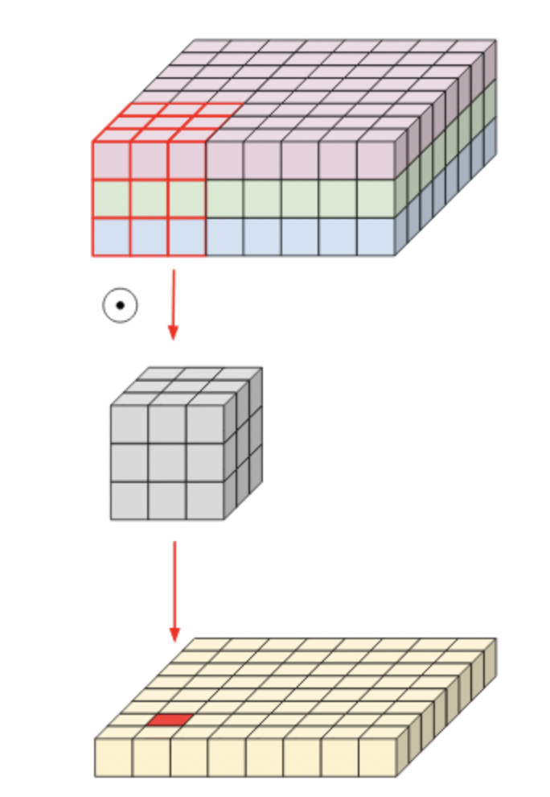
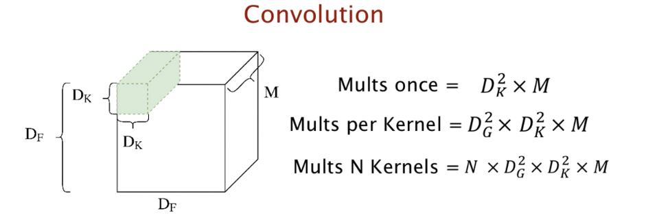
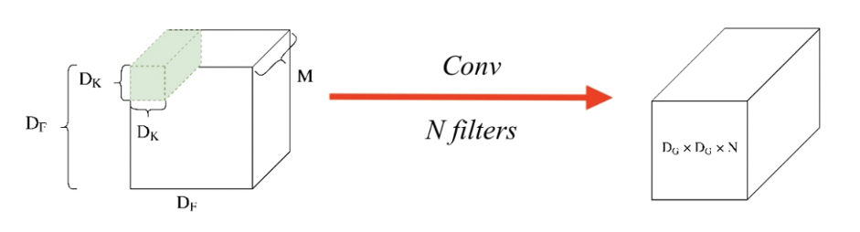
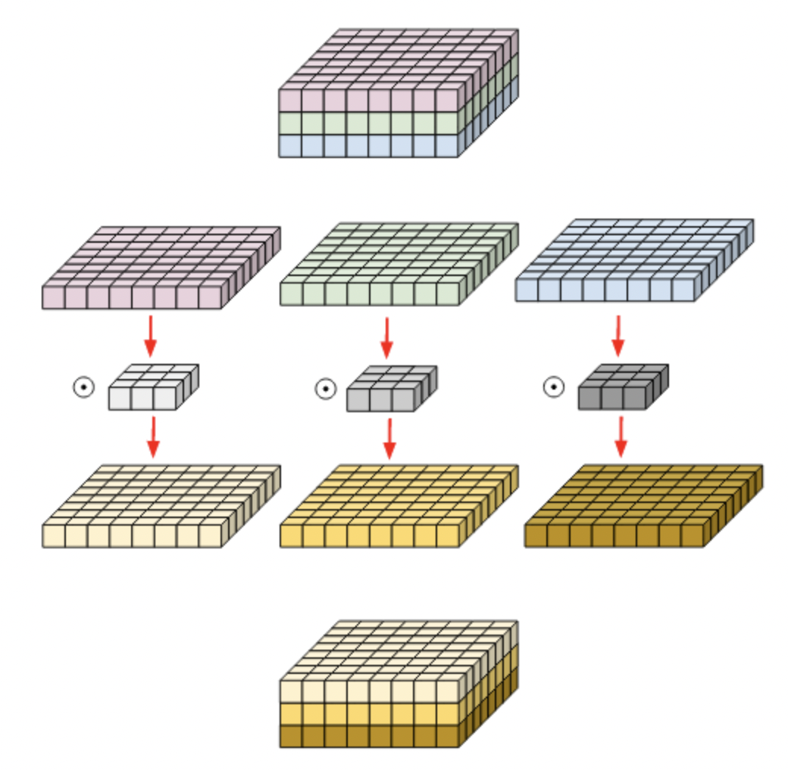
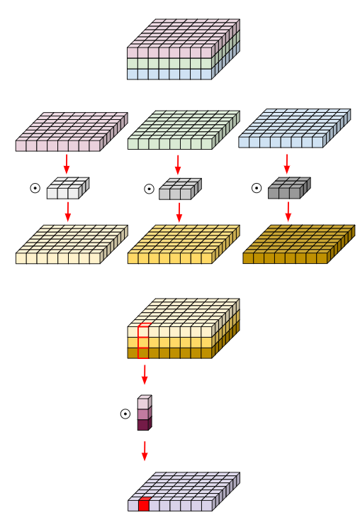
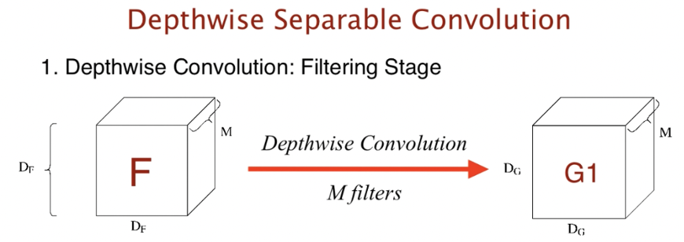
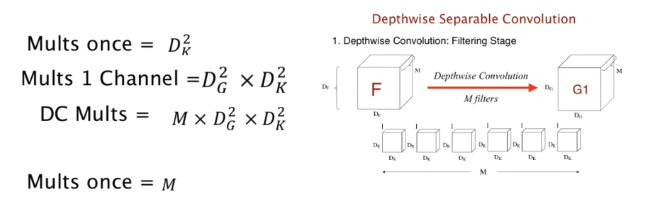

# Depthwise Separable CNN

## Existing two-dimensional convolution has three problems.
- Expensive Cost
- Dead Channels
- Low Correlation between channels

### The reasons are as follows. In the case of an image, it is generally composed of three channels (RGB) and the information on the object in the image is accurately determined through convolution, where contextual information is important. In other words, it is necessary to consider a relatively wide receptive field to determine the background around the object, what kind, etc., so the kernel size is expanded or more convolution layers are stacked. However, if the model architecture design is carried out in this way, the computation amount can be greatly increased due to the rapid increase in the number of parameters.
### In addition, care should be taken when learning because the correlation between each channel can be reduced if sensor data is configured into multiple channels as input, such as when using multiple sensor data rather than images. 

# Normal Convolution

 

### In general, in the case of CNN, the above filters derive the output while sequentially performing convolution operations. 
 
 

### If this is done for multi-channel inputs, the operation is performed at once using a three-channel kernel filter and the corresponding output is derived. Since a typical convolutional filter is affected by all channels in the input image, it is impossible to extract a spatial feature only for a specific channel completely. In other words, it means that it is inevitable that information on other channels is involved.

 
  

  

### The computation is as follows. Since the filter size is Dk*Dk and consists of M channels, it must be multiplied. In addition, since the output size is Dg * Dg * N, the total computation is Dk * Dk * Dg * Dg * N * M.

# Depthwise Convolution
 
   

### The representative structure of the Depthwise convolution is as above. The Depthwise Convolution used filters performed only for each single channel. In the MobileNet structure, Depthwise Convolution was selected to reduce the computation amount exponentially so that it can be operated in real time. Let's look at how we were able to reduce the computation exponentially. 
### This is an example of using a 3x3x3 kernel for 8x8x3 matrix depthwise convolution, as shown in the figure above. At this time, the kernel is separated for each channel, and a 3x3 two-dimensional kernel is attached to each separated matrix of 8x8 size to proceed with each convolution and merge again. That is, it may be considered that the convolution in the channel direction was not performed, but only the convolution in the spatial direction was performed. 
### That is, each kernel has a parameter for only one channel. Therefore, the number of input and output channels is the same, and the filter is learned using only spatial information unique to each channel. As a result, it is equal to the grouped convolution divided by the number of input channels. 

# Depthwise separable convolution

### Unlike the above Depthwise Convolution, this Depthwise Separable Convolution is characterized by the aggregation of the channel's output values. This is a method of lightening the network by considering both the Spatial Feature and the Channel-wise Feature.  Although it behaves almost like conventional convolution operations, the number of parameters and the amount of operations are much smaller. In the result of the existing Depthwise Convolution, an additional convolution that can compress each channel into one channel was performed so that the result was very simple. 

### The computational quantity is as follows. In the standard convolution operation we are familiar with, one kernel did the operation on channel M. However, this time, the kernel's channel is a one-channel kernel, which only operates on one channel for input. The kernel looks like Dk*Dk*1. Dk*Dk is when one kernel calculates for an input once. And Dg * Dg * Dk * Dk * Dk is required to compute for 1 channel. And since there are a total of M kernels, the total computation of Depthwise Convolution is Dg * Dg * Dk * Dk * M.

