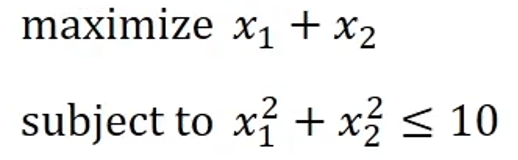
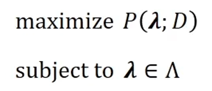
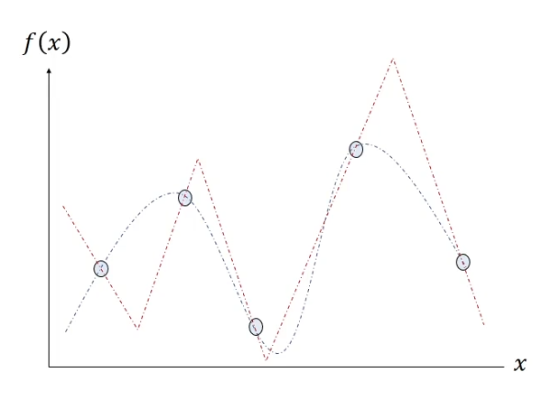
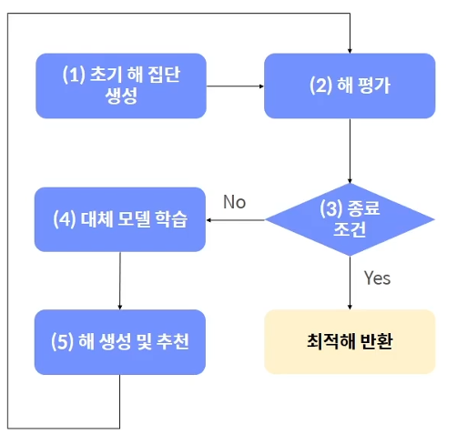
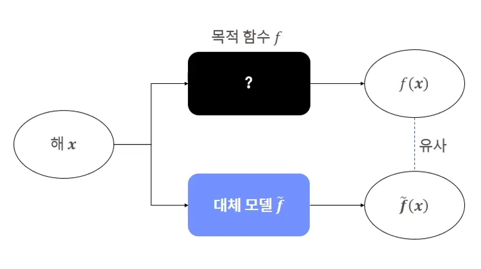
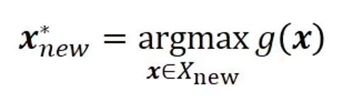
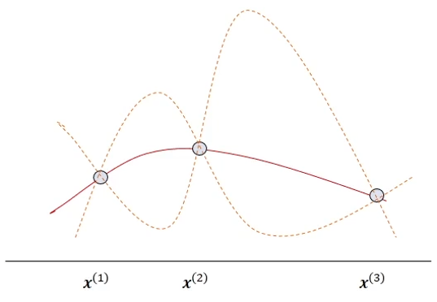
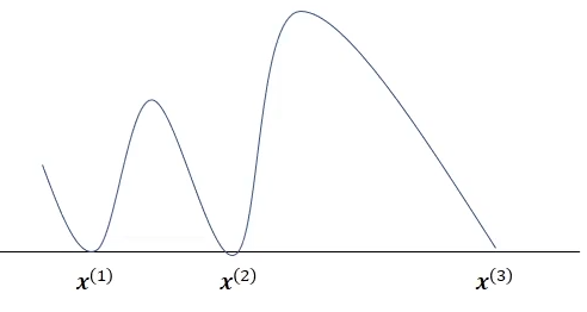

# Bayesian Optimization

## 1. Black box optimization problem
- The black box optimization problem refers to an optimization problem with unknown relationships between objective functions, constraints, and determinants. Specifically, it refers to a problem in which you do not know the objective function value according to the decision variable or whether you satisfy the constraint without additional experiments and measurements.

 

### Common Optimization Issues
- It is an optimization problem that shows the relationship between the decision variable and the objective function, and between the decision variable and the constraint
 
### Blackbox optimization issues
- Hyperparameter tuning problems
- P in the objective function represents performance
  

The black box optimization problem is not known exactly for the objective function and must be solved empirically. This means that the search space is determined by inferring the objective function based on the data
 
   

- X and f(x) represent determinants and objective functions, respectively
- The five blue circles represent data points in the form (x, f(x)) measured by experiments, etc
- There are infinitely many functions that can be estimated by five data points, but only two functions shown in blue and red in this figure
- The two functions seem to have similar graph structures, but they judge the location of the optimal solution differently. If it is a maximization problem, it is judged that the optimal solution for estimating the objective function as the blue function is more to the left than for estimating the objective function as the red function
- However, since the function is estimated from the data point, it is not known whether it is more appropriate to use the red function or the blue function

### Difficulty obtaining data
The more data points there are, the more accurate function estimation is possible. However, evaluating the objective function of the black box optimization problem takes a long time, making it difficult to obtain many data points.
### Suitable when the objective function has the following characteristics
- Function value is continuous in certain intervals
- Expensive to evaluate objective functions
- Unable to use descending slope method, etc. due to unknown derivative
- Assume that no noise is generated during solution assessment

Bayesian optimization explores solutions as samplers, surrogate models, and acquisition functions interact
    

1) Initial solution group X={x1,x2,x3,… using samplerCreate ,xn}
2) Evaluate solution using objective function
3) Ensure that the termination conditions are met. If you are satisfied, return the best year you have found so far, terminate the algorithm, otherwise go to number 4.
4) Learn or update alternative models using the years you have explored to date. Alternative model is a supervised learning model whose features are harms and labels are objective function values
5) Multiple solutions are randomly generated using a sampler. Evaluate the generated year as an alternative model and an acquisition function to recommend an excellent year and return to #2
    

## 2. Alternative Model
An alternative model is a regression model that simulates the objective function
 
- An alternative model is needed because it takes a lot of time and money to evaluate solutions using objective functions
- All solutions are evaluated as alternative models without using objective functions, and then only those years worth evaluating are selected and evaluated using objective functions
- Alternative models are supervised learning models that can quickly assess solutions once learned
- Alternative models are needed to reduce the time to evaluate solutions using objective functions

## 3. Acquisition function
- The acquisition function evaluates all solutions belonging to the set Xnew that do not know the actual output and recommends the largest of them. Some top k years are recommended depending on the situation
     

- g:Acquisition function -> Recommended year Xnew actually conducts an assessment and relearns the Gaussian process model including (Xnew, f(Xnew))

Acquisition functions consist of exploitation and exploration strategies. Exploitation strategy is a strategy to find a solution near a good year, and search strategy is a strategy to find a section that has not yet been explored.

### Objective function
 
- Evaluate three inputs x1, x2, x3 to date
    

- Red solid line: the average of the estimated objective function
- Orange dotted line: the predicted interval of the estimated objective function

### Acquisition function

- Deviations for f(x1), f(x2), and f(x3) are zero
     

- Knowing the outputs for x1, x2, x3, the acquisition function value is zero because it is not worth evaluating
- The acquisition function value of the value between x2 and x3 with a large deviation and a relatively expected value is greater than the acquisition function value for the value in the other interval.

### Improvement probability function
- The improvement probability function is the probability of deriving a function value greater than the maximum output value found so far.

  
### Improvement Expectation Function
- The most widely used acquisition function, the improvement expectation function, represents the degree of renewal of the expected function value by exploring a new solution
- The expected value is positive if the new year f(xnew) is better than the best year max(f(xi)) that has been explored so far; otherwise, nothing improves, so it becomes zero