# ARIMA
Time Series Data Analysis Method and ARIMA Machine Learning Method

## 1. Time Series Data
: Collect according to a certain time difference
→ Time series has a correlation between time (variables) unlike general data

1) Time series = Systematic components (Trend + Seasonal + Cycle) + Random functional

2) Normal and Abnormal Time Series

→ Normal time series : Mean, variance constant over time
→ Abnormal time series → difficult to model, convert to normal time series

 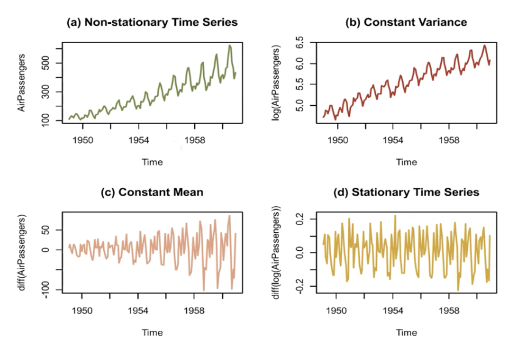

## 2. Time series data decomposition
1) Additive Decomposition Vs Multiplicative Decomposition
 
  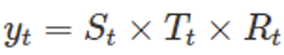
  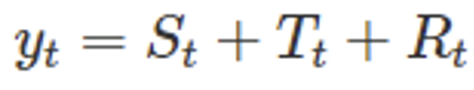

-> Variable width is constant: Additive,
-> Variation width is constant X → Log conversion required : Multiplicative
2) Basic Decomposition Principle: Classic Seasonal Decomposition
⇒ Trend of data: Moving Average (MA)
⇒ Measurement of seasonal components: Overall - trend of data → moving average
3) Related model : seasonal_decomposition, X11, SEATS, STL	
3
## 3. Time Series Prediction Model: Using Past Prediction Values
 1) AR (Auto Regressive model) → RNN과 유사함
: When predicting the time point t, use your own value from t to the time point p away
-Autocorrelation was constructed as a time series model, and it is a model that predicts the future value of the corresponding variable by linear combination of the past observed values of the specific variable to be predicted. The idea is that your previous observations affect your subsequent observations.

⇒ autocorrelation modeling
   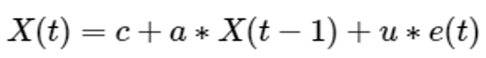

ex) AR(p=1) : Only data prior to one time interval is used to predict current data.
    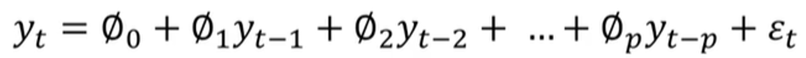

 2) MA(Moving Average model)
: When predicting the time point t, use the error value from t to the time point p away
⇒ Modeled using the effects of predictive errors
     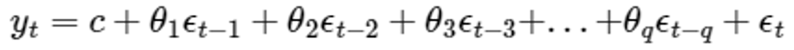

 3) ARMA(AutoRegressive and Moving Average model)
⇒ Error + Autorrelation all Considerations
      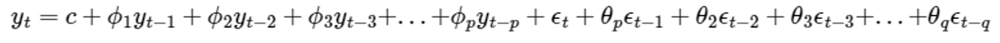

 4) ARIMA : ARMA + Trends in historical data

## (1) ARIMA
Autoregressive Integrated Moving Average,  AR+MA model.
ARIMA(p,d,q) model is integrated model of AR(p) and MA(q) models for d-differenced data
⇒ error + Autocorrelation + Trend consideration. (Seasonal Variation  X)
      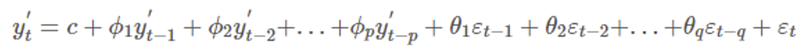

: ARMA model + d time differnecing
: Variables to be obtained → p (autocorrelation), d (differential coefficient), q (normality coefficient of residuals)
⇒ ACF of residuals after obtaining the model
⇒ If the residuals represent normality, it is a well-made model (satisfied with the assumption)
How to find a Q variable: ACF, PACF
ACF - correlation of t and t+k
PACF - correlation between t and t+k except for the effects of what is in between

## (2) Differences from existing prediction models: Abnormalities data applicable
→ Original model: Using differentiation → Change to data with normality and applied
→ A model that considers differentiation itself
## (3) To determine whether to use ARIMA
⇒ If it's a Non Stationary even though you've done Differencecting more than 3 times, use a different model 

##  ACF(Auto Correlation Function)
It refers to a series of autocorrelation according to the time difference, and as the time difference increases, the ACF approaches 0.
Stationary time service is relatively quick convergence and the zero for non standard time series by slowly.
       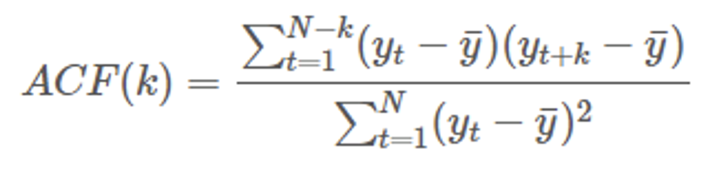

be useful in determining the normality

## Example
### 200 Days of Google Stock Price, Time Series
 
Without normality, the ACF graph is as follows
       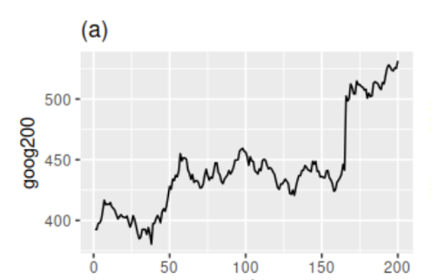

Differencing and ACF results in:
       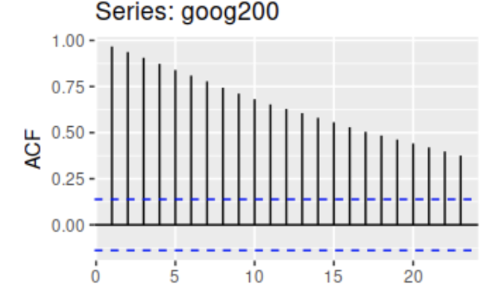

It can be seen that it converges faster to 0 than the raw signal before the difference.
       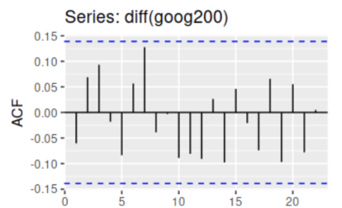

## PACF(Partial Auto Correlation Function)
It is a series of partial autocorrelation with parallax, and is a pure interrelationship between two time series data with different parallax. 
       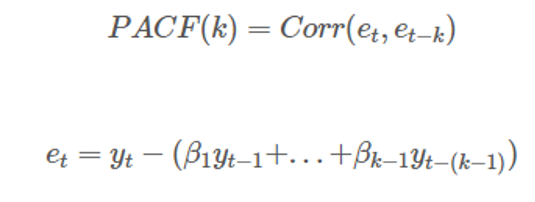

As a pure correlation between T and T-k time points, any influence of y contained between the two time points is eliminated.
         

 

## +) SARIMAX :
Even seasonal models (typically, time series data such as weather data and power include seasonality, so it is appropriate to use this)
⇒ ARIMA+ pdq + seasonal componet are considered
