# Gaussian Process


## Random variable: Defined as a function that corresponds the real value to the result of a probability experiment

## Random process: defined as a set of infinite random variables indexed by a parameter. A random process can be thought of as a function consisting of two variables: probability experiment results and index parameters.

### X:space parameter index, f:random process, f(e,x)

### If the index parameters are fixed, the random process becomes a random variable. Furthermore, if the probability experiment results are fixed, the random process becomes a definitive function. This function is called a sample function.
 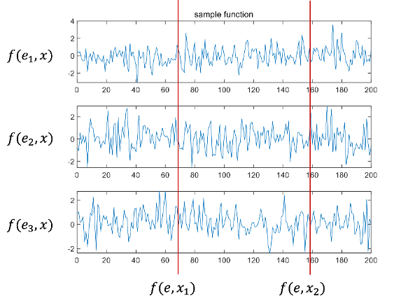


### A Gaussian process (GP) is defined as a random process in which any combination of random variables in a set of processes has a joint Gaussian distribution

### When the random variable corresponding to index x1,x2,...,xm is fi=f(xi), all possible subsets {f1},{f2,f3},...,{f1,f2,fm} are processes with combined Gaussian distributions

### The vector f1:m=[f1,f2...] with fi as its component.fm]T is a process in which it is a random vector. Here, since m is the number of indexes arbitrarily selected in the process, the Gaussian random vector may have an infinite dimension. In other words, the Gaussian process may be described as an infinite dimensional extension of the Gaussian random vector

### Just as the characteristics of Gaussian random vectors are expressed by means and covariance, the Gaussian process can also be characterized by the mean function μ(x) and covariance k(x,x').
 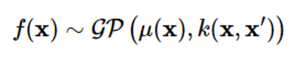

### Covariance is expressed as follows
  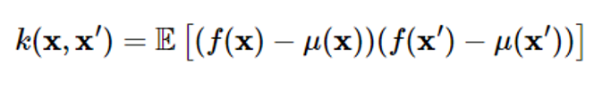

### Covariance represents the correlation between two different points x and x' within the process

### In the Gaussian process, covariance k(x,x') is called a kernel function

### 10 sample functions of the Gaussian process when μ(x)=0, k(x,x')=exp((-12(x-x')2) are drawn
  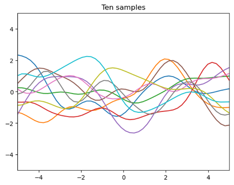

### m datasets D={(x1,f1),(x2,f2),...(xm,fm)} as shown below when given
  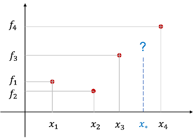

### The regression problem is to estimate the dependent variable value f 을 corresponding to a specific value x 에 of an independent variable that is not in the dataset
### A common way to think is to fit a function fitting
### Depending on the trend of the data, the unknown target function g(x) is assumed to be a polynomial or non-plural function such as a primary or secondary function, and the parameters of the selected function model are estimated using the least squares method. And calculate f=gg(x)) using the estimated function
 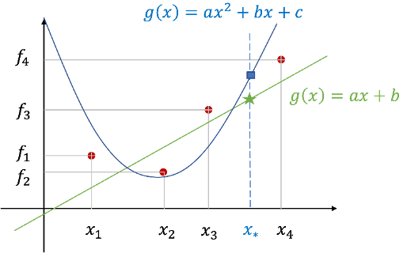

 
### On the other hand, GP regression issues use a different approach
### Consider it a Gaussian process f(x) instead of assuming that the objective function has a specific shape
### Can be seen as an approach that gives probabilities for all feasible functions
### Expressing an unknown function as a Gaussian process f(x) is a dataset of m observations f1:m=[f1f2...fm]To consider T as a sampled value at a specific index x1:m of a Gaussian process
  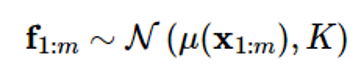

  

 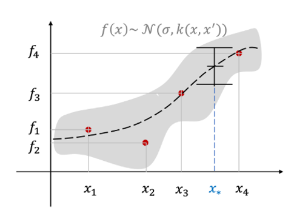

 
### For GP regression issues, enter index parameter x
### Inputs are usually represented as vectors because there are many input variables
### The observed value or output fi has a continuous value
### In the GP classification problem, the observed value is a discrete value. The mean function μ(x) represents the overall trend of observations, and the kernel function k(x,x') represents the geometric similarity between the two observations
### If there is no prior information about the unknown target function, the average function is placed as μ(x)=0. Functions commonly used as kernel functions are radial basis functions (RBFs) similar to Gaussian probability density functions as follows:
  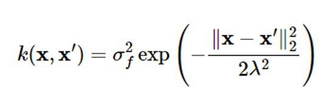

### where ff2 represents the size of the maximum covariance that the kernel can express
### When xxx' the kernel approaches the maximum value ff2
### Meaning that two points are closely related to each other
### The further x and x' apart from each other, the closer the kernel value is to zero, which means that the two points are less relevant
### A value 22 that can adjust the degree of relevance
### Even if the distance between two points is the same, the larger the value, the more relevant the two points are
### ff2 and 22 are called kernel parameters
### The GP regression problem is a problem of estimating the output f==[fm+1...fm+p]T corresponding to p inputs {xm+1,...,xm+p} given m datasets D={(xi,fi), i1,1,...,m}, which can be formulated as follows in the Gaussian process frame

### Given a Gaussian distribution,
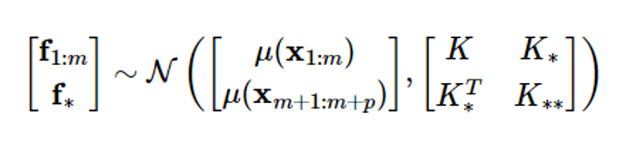

### The problem of obtaining the conditional probability density function p(f||x1:m,xm+1:m+p,f1:m) of f  
 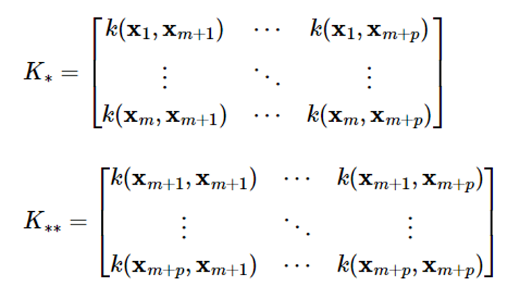


# Gaussian process regression

### If noise is modeled as a Gaussian with a mean of 0 and a variance of 2n2, the Gaussian process (GP) measurement model is as follows:
 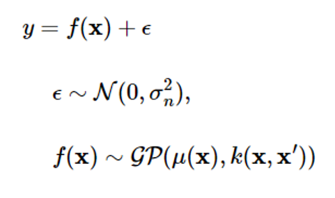

 
### Assuming that noise is independent of the Gaussian process, the mean and covariance of the Gaussian process y will be
  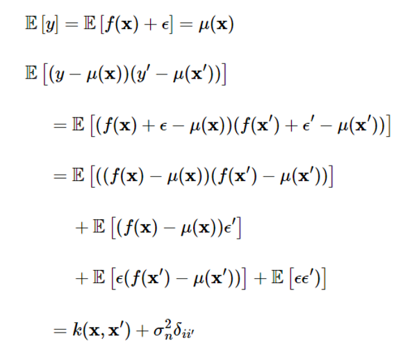

### Here, δii′  is a Kronecker's delta function and is 1 only if x=x′. Simply put, the expression is as follows:
   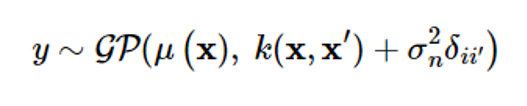

### Given the dataset D={(xi,yi), i=1,...,m}, let's find the conditional probability density function p(yy|y1:m) of the output y[=[ym+1...ym+p]T corresponding to the input {xm+1,...,xm+p}. The joint probability distribution of the associated random vectors is as follows
   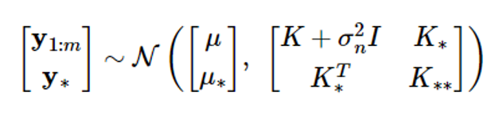

### where μ = μ (x1:m), μ = μ (xm+1:m+p)
### According to the Gaussian random vector characteristics, if y1:m and y 가 have a combined Gaussian distribution, the conditional probability density function of the random vector y 의 is also Gaussian, and the mean and covariance are given as follows:
   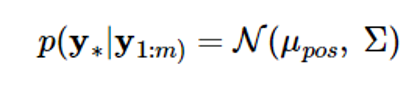
   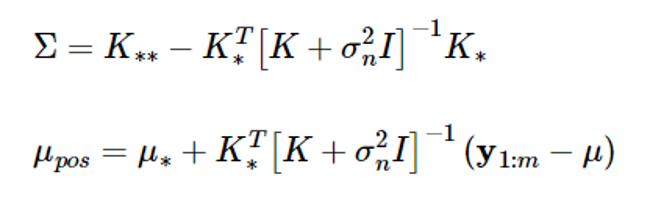
    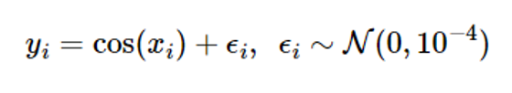

### The above equation calculates the estimated value y 와 and the estimated probability using the given datasets D={(xi,yi), i=1,...,m}

### Estimate the function g(x)=cos((x) as a Gaussian process f(x) as an example
### Assume that g(x) is an unknown function
### Assume a Gaussian with a mean of 0 and variance of 이n2 = 10-4
### The dataset is D=₩(xi,yi), i=1,...,5} at x1=-4, x2=-3, x3=-2, x4=-1, x5=4 
   
```python
# true function
f = lambda x: np.cos(x).flatten()
 
s = 0.01       # noise std

# training points (given)
X = np.array([ [-4], [-3], [-2], [-1], [4] ])
m = X.shape[0]  # number of training points
y = f(X) + s*np.random.randn(m)  #(m,)
```

   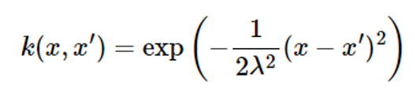

### Assuming that there is no information about the function g(x), let the average function of the Gaussian process be μ(x) = 0, and the kernel has the following expression: 
### Place lambda2=1 here
```python
def kernel(a, b): 
	         lam2 = 1 sqdist = np.sum(a**2,1).reshape(-1,1) + np.sum(b**2,1) - 2*np.dot(a, b.T) 
return np.exp(-.5 * sqdist / lam2)
```
### The covariance K of Equation (4) can be calculated as follows.
```python
K = kernel(X, X)
```

### Specify 50 test inputs x=(x1,...,xp) at regular intervals in the [-5,5] range
```python
p = 50 
# number of test points 
# points for prediction 
Xstar = np.linspace(-5, 5, p).reshape(-1,1)
```
### Then, the covariances K 와 and K∗ 는 of Equation (4) are calculated as follows.
```python
Kstar = kernel(X, Xstar)
K2star = kernel(Xstar, Xstar)
```
### Now, you can calculate the conditional mean and covariance of Equation (5).
   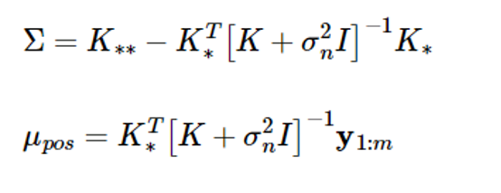


### Since Equation (8) includes inverse matrix calculations, the Cholesky decomposition is used as follows, considering the computation volume and numerical error
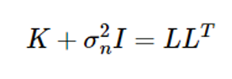

### Then the covariance expression in equation (8) is:
 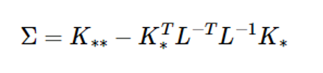


### If L* is calculated to be K∗=LL∗ , the above equation is as follows:
 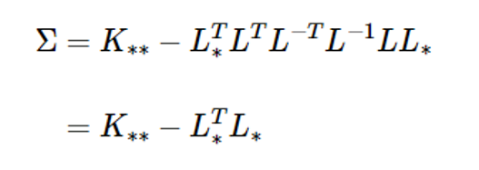

 ```python
L = np.linalg.cholesky(K + s**2*np.eye(m))
Lstar = np.linalg.solve(L, Kstar)

Sig = K2star - np.dot(Lstar.T, Lstar)
```

 ### In addition, the mean expression of expression (8) also becomes
  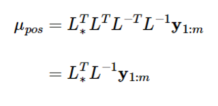

 
### If you put L-1y1:m=v here, the above equation will be
  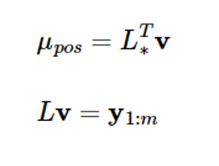

  ```python
mu_pos = np.dot(Lstar.T, np.linalg.solve(L, y))
```
### Plot the mean value of y 의 and the 3-standard deviation (3)) at the test input x={x1,...,xp} calculated by expression (8), as follows:
   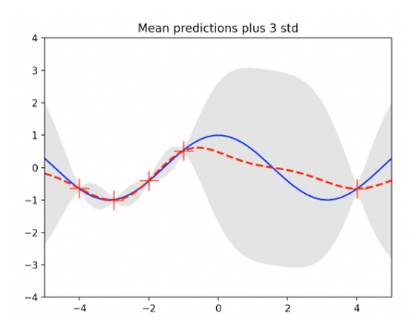

### The standard deviation of the data-intensive area (between -4 and -1) is less than that of the data-free area (between 0 and 4)
### The following figure is drawn by extracting 10 sample functions from a Gaussian process with a mean function μ(x)=0 and a covariance equation (7)
### Using the first assumed Gaussian process probability information

### This is called a pre-process (GP priority)
   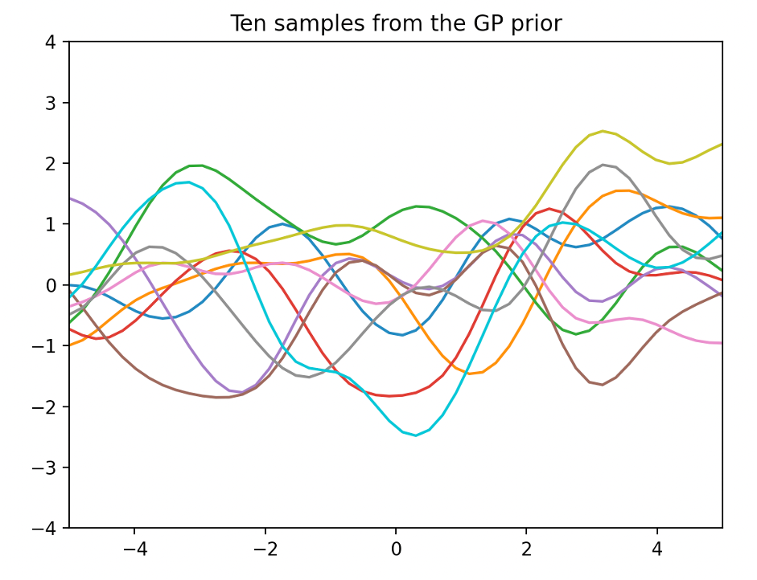

 
### The following figure is drawn by extracting 10 sample functions from the Gaussian process with the mean function and covariance calculated by Equation (8)
### It is a process obtained by updating the GP priority using a dataset, so it is called a post-process (GP poster)
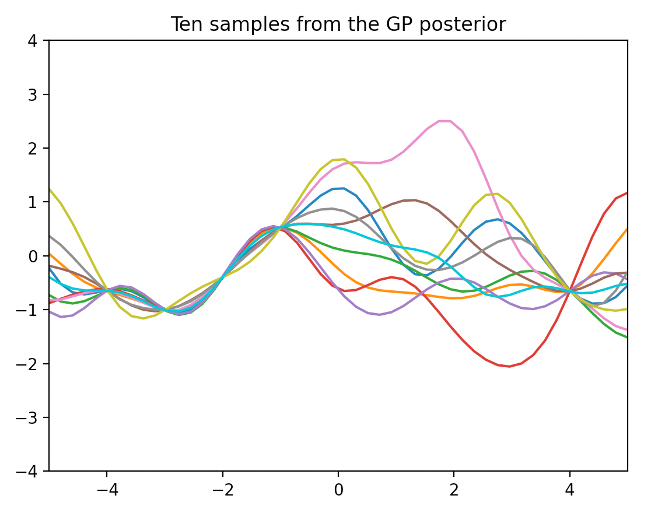

### The following figure shows GP regression with 22=0.1 in kernel expression (7)

 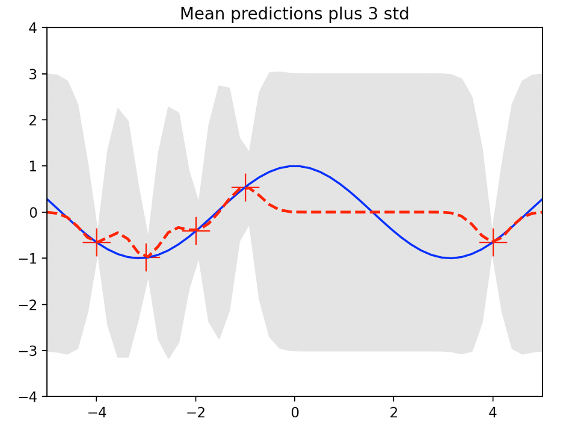

### The following illustration shows GP regression performed at 22=10
  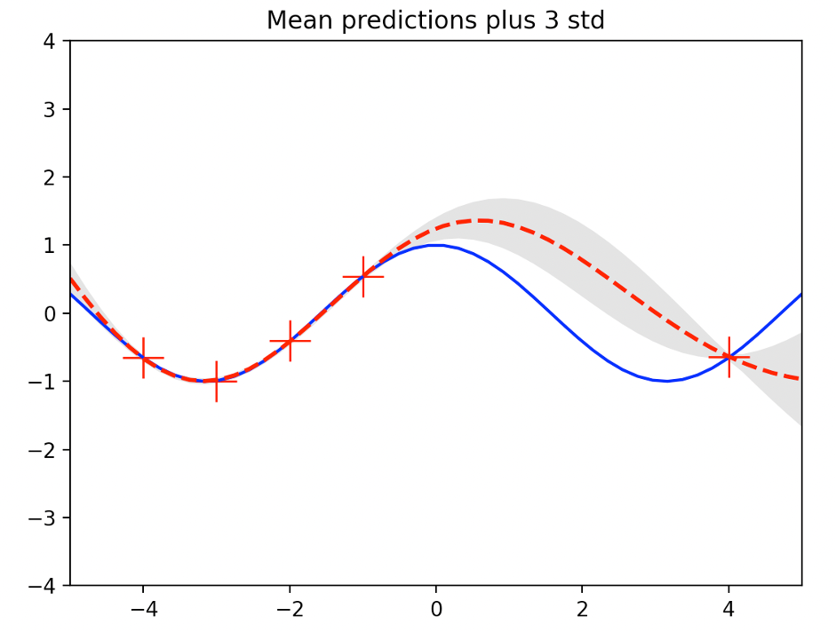


### A smaller 22 reflects a smaller association of the dataset, indicating that the variance value is very large
### Conversely, a larger value over-refers to the relevance of the dataset, indicating that the variance value is small but the estimate has a larger bias
### As such, the performance of GP regression is greatly affected by the kernel parameter value
### Therefore, it is necessary to devise a method to learn kernel parameters with optimal values using datasets