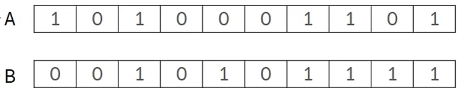
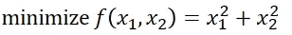
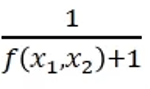
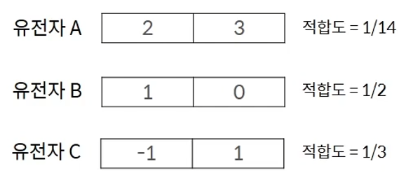
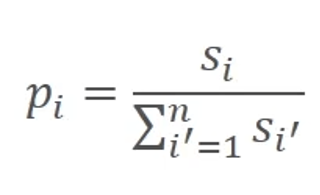
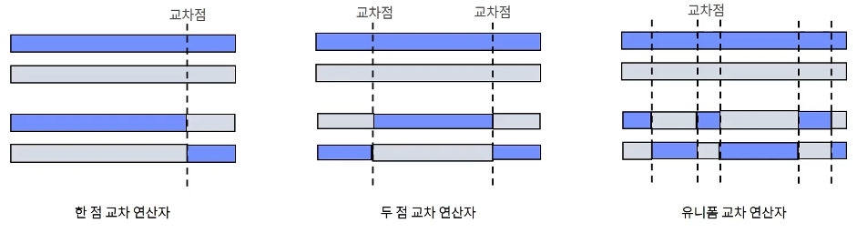
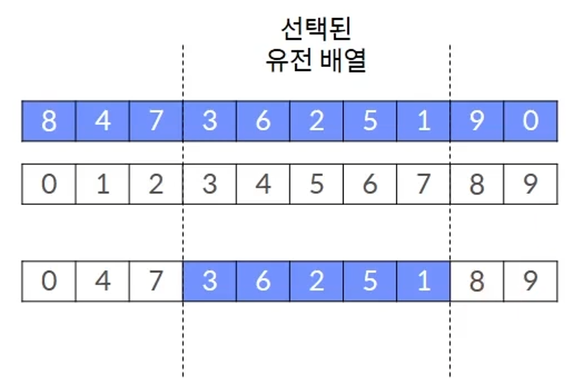

# Genetic Algorithm
Heuristic solution to imitate the genetic algorithm is the biological world evolution.

# 1. Overview of the genetic algorithm and configuration
Survival of the feeling of appropriate genes suitable for the survival rate : this problematic situation in the environment - > The days are alive.

|The evolution of animate nature|Genetic Algorithm|
|------|---|
|Gene|Fitness function|
|Compliance with the environment|Selective Operations: Select a solution with a high fit|
|Perfect for gene is alive|MIXING OPERATION: MIXING TWO SOLUTIONS|
|Mutations are sometimes born|Mutation Operations: Modifying some random solutions|

### (1) Initial solution group generation: Group formation by randomly creating multiple initial solutions. The solution group in the conversion is called generation.

### (2) Group of solutions: Evaluate all solutions in a generation using the goodness-of-fit function. Calculate the fit for each year

### (3) Evaluation of termination conditions: Ensure that the termination conditions are met, such as reaching the maximum number of iterations or converging solutions. If the termination conditions are met, return the year with the highest degree of conformity to date and exit the algorithm

### (4) Create a new solution group: use selective operations, hybrid operations, and mutation operations to create a new solution group and return to (2)

    A. Selective Operations: Select the year to configure the next generation. Some bad fit years are selected
    B. Hybrid operation: Create a new solution by repeating the process of applying the hybrid operation by randomly selecting two of the selected years. Create equal number of years per generation
    C. Mutation Operations: For the diversity of solutions, a mutation operation is applied to a portion of the year created by hybridization.

### Features and pros and cons
- Genetic algorithms, unlike other optimization algorithms, explore many years at the same time
- It also performs inter-year operations, so you can expect better results than running algorithms that explore one solution in parallel
- Even if the objective function is not differentiable, it can be applied without difficulty
- You must design or select solution representation methods, cross operations, mutation operations, fitness functions, etc. to fit the problem
- Genetic algorithms are unstable algorithms that can produce very good results or very bad results

### Key Hyperparameters
- Number of generations and solution size: Select maximum number of iterations because large search spaces make it difficult for genetic algorithms to converge
- Larger generations take longer, but it's good to find a good year
Selective Operators
- When the fit difference is large each year, the roulette wheel is less likely to select a bad year, but the ranking selection is more likely to select a bad year
- If you choose only elitist, you are less likely to choose a bad year
Cross operator
- Cross operators can be distinguished by how complex the solutions are mixed
- The more complex the solutions are, the more diverse they can be explored
a mutation operator
- Can be distinguished by how different genes are produced

# 2. A method of gene expression

## Binary encoding
- How all solutions are expressed as 0 and 1

 

- A good structure to apply hybridization and mutation operations
- However, the disadvantage is that the range of expression is limited
- Binary encoding is primarily used to represent solutions to combinatorial optimization problems, including feature selection

## Permutation encoding
- permutation encoding is a solution representation method that is primarily used for problems that determine order, such as the circulation problem of an external source, that represents the order of each solution

 

- No overlap between elements because it represents an order
- There is a risk of creating a non-executable solution when cross-operating and mutation operations are performed

# 3,Fitability and Selective Operations
## Fitness
- It is common to use objective functions as a function to assess how suitable each solution is for the answer to the question
 

## Objective Function
 

## Fitting function
 

## A roulette wheel
- Select probabilistic selection of each solution in proportion to fit
- n candidate years. x1, x2,..., The fit of the two is s1, s2, …., If sn is the probability that xi will be selected, pi is defined as follows
 

- However, years already selected are excluded from the candidate to prevent duplicate selection of the same year

## Rank selection
- Apply roulette wheel selection based on ranking based on goodness-of-fit scores. This means that the roulette wheel selection is applied by converting the score to rank so that the most suitable year has n points and the lowest year has 1 point.
 

- n candidate years. x1, x2,..., The fit of the two is s1, s2, …., If sn is the probability that xi will be selected, pi is defined as follows

- Fit must be positive to select solution in proportion to fit
- The roulette method is not likely to be selected for another solution if one fit is much greater than the other, so the ranking method can pursue diversity
elitism
- Deterministic selection of some solutions to prevent the best k solutions from being selected. Select the top k<=n solutions with high fit, then select the rest by roulette wheel or rank selection.

# 4.Cross operation and mutation operation
The cross operator for binary encoding mixes two genes based on randomly selected intersections
 

Cross operator for permutation encoding
- A representative cross operator for a solution expressed by permutation encoding is an ordered cross operator. An ordered cross operator takes some sequences of one parent gene as they are, and the remaining values follow the sequence of genes of another parent.
 
